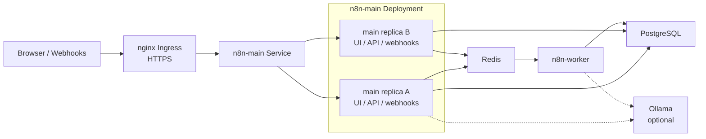
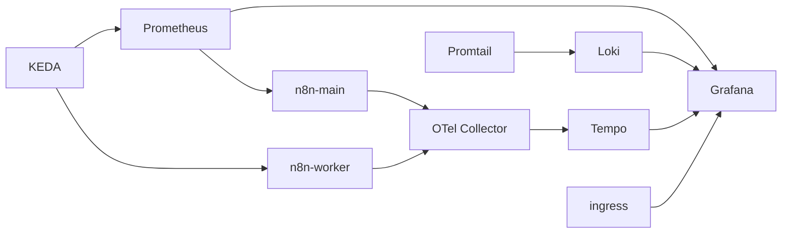

# n8n Local Kubernetes Stack

A Helm chart for running a fully local, self-hosted n8n Enterprise-style Kubernetes lab with queue workers, nginx ingress, mkcert TLS, observability, and optional Ollama.

This repository is safe to publish. Commit the chart and example values. Keep private overrides, TLS key material, rendered manifests, and cluster exports out of Git.

## What You Get

- **Local hostnames only** — `n8n.local` and `grafana.local` via `/etc/hosts`
- **HTTPS** — terminated at nginx ingress using [mkcert](https://github.com/FiloSottile/mkcert) certificates
- **Queue mode** — `n8n-main` for UI/API/webhooks, `n8n-worker` for execution
- **Observability** — Prometheus, Grafana, Loki, Tempo, OpenTelemetry, Promtail
- **Autoscaling** — KEDA scales workers on queue depth

No public domain, Cloudflare, or external certificate authority is required.

## Architecture

### Runtime



### Observability



## Repository Layout

```text
n8n-enterprise-local/
├── Chart.yaml
├── values.yaml
├── values.local.example.yaml
├── scripts/
│   └── setup-local-tls.sh
└── templates/
    ├── _helpers.tpl
    ├── ingress.yaml
    ├── n8n-main.yaml
    ├── n8n-worker.yaml
    ├── postgres.yaml
    ├── redis.yaml
    ├── prometheus.yaml
    ├── grafana.yaml
    ├── loki.yaml
    ├── tempo.yaml
    ├── otel-collector.yaml
    ├── promtail.yaml
    ├── keda.yaml
    ├── ollama-*.yaml
    ├── secrets.yaml
    └── NOTES.txt
```

## Values Strategy

| File | Purpose |
| --- | --- |
| `values.yaml` | Committed defaults |
| `values.local.example.yaml` | Committed starting point for local overrides |
| `values.local.yaml` | Your private overrides (gitignored) |
| `values.secret.yaml` | Optional private credentials (gitignored) |
| `certs/` | mkcert output (gitignored) |

## Prerequisites

- Kubernetes with a default `StorageClass` (Docker Desktop, kind, or minikube all work)
- `kubectl` and Helm 3+
- nginx Ingress Controller
- [mkcert](https://github.com/FiloSottile/mkcert)
- KEDA (optional, for worker autoscaling)

## First-Time Setup

### 1. Create the namespace

```bash
kubectl create namespace n8n
```

### 2. Install nginx ingress (if needed)

Docker Desktop does not include an ingress controller by default:

```bash
helm repo add ingress-nginx https://kubernetes.github.io/ingress-nginx
helm repo update
helm upgrade --install ingress-nginx ingress-nginx/ingress-nginx \
  --namespace ingress-nginx --create-namespace
```

### 3. Configure local hostnames

Add to `/etc/hosts`:

```text
127.0.0.1 n8n.local grafana.local
```

On Docker Desktop, point these at localhost where the ingress controller is reachable.

### 4. Create TLS certificates

Manual setup:

```bash
brew install mkcert
mkcert -install   # installs the local CA; requires your password once
mkcert n8n.local grafana.local

kubectl -n n8n create secret tls n8n-tls \
  --cert=n8n.local+1.pem \
  --key=n8n.local+1-key.pem
```

Or use the helper script (writes certs to the gitignored `certs/` directory):

```bash
chmod +x scripts/setup-local-tls.sh
./scripts/setup-local-tls.sh
```

Store cert files outside the repo, or in the gitignored `certs/` directory.

### 5. Create application secrets

```bash
kubectl -n n8n create secret generic n8n-secrets \
  --from-literal=POSTGRES_PASSWORD='replace-me' \
  --from-literal=N8N_ENCRYPTION_KEY='replace-me'
```

If restoring existing n8n data, reuse the original `N8N_ENCRYPTION_KEY`.

### 6. Install KEDA (optional)

```bash
helm repo add kedacore https://kedacore.github.io/charts
helm repo update
helm upgrade --install keda kedacore/keda --namespace keda --create-namespace
```

Set `keda.enabled: false` in your values file if you skip this step.

### 7. Configure local values

```bash
cp values.local.example.yaml values.local.yaml
```

If Ollama is already installed as a separate Helm release in the same namespace, keep `ollama.enabled: false` in `values.local.yaml` to avoid ownership conflicts.

### 8. Deploy

```bash
helm upgrade --install n8n . --namespace n8n -f values.local.yaml
```

Open:

- n8n: `https://n8n.local/`
- Grafana: `https://grafana.local/`

## Verification

```bash
kubectl get pods,ingress,secrets -n n8n
curl -sk -o /dev/null -w "n8n: %{http_code}\n" https://n8n.local/
curl -sk -o /dev/null -w "grafana: %{http_code}\n" https://grafana.local/
kubectl logs -n n8n deploy/n8n-main --tail=50
```

Check n8n URL settings inside the pod:

```bash
kubectl exec -n n8n deploy/n8n-main -- env | rg 'N8N_(HOST|PROTOCOL|SECURE|EDITOR)|WEBHOOK'
```

Expected values:

```text
N8N_HOST=n8n.local
N8N_PROTOCOL=https
N8N_SECURE_COOKIE=true
WEBHOOK_URL=https://n8n.local/
N8N_EDITOR_BASE_URL=https://n8n.local/
```

## Updating

Render and diff before applying:

```bash
helm template n8n . --namespace n8n -f values.local.yaml > rendered.yaml
kubectl diff -n n8n -f rendered.yaml
```

Upgrade:

```bash
helm upgrade n8n . --namespace n8n -f values.local.yaml
```

If Helm reports server-side apply conflicts after manual `kubectl set env` changes, retry with:

```bash
helm upgrade n8n . --namespace n8n -f values.local.yaml --force-conflicts
```

## Ollama

Enable in `values.local.yaml` when Ollama is managed by this chart:

```yaml
ollama:
  enabled: true
  persistence:
    size: 30Gi
  models:
    - llama3.1
```

Check models:

```bash
kubectl exec -n n8n deploy/ollama -- ollama list
```

Pull manually:

```bash
kubectl exec -n n8n deploy/ollama -- ollama pull llama3.1
```

## Configuration Flags

| Value | Default | Purpose |
| --- | --- | --- |
| `ingress.enabled` | `true` | Create nginx Ingress for n8n and Grafana |
| `ingress.tls.enabled` | `true` | Terminate HTTPS using the `n8n-tls` secret |
| `ingress.tls.secretName` | `n8n-tls` | TLS secret name in the release namespace |
| `ollama.enabled` | `true` | Deploy Ollama via this chart |
| `keda.enabled` | `true` | Create the worker `ScaledObject` |
| `n8n.otel.enabled` | `true` | Export OTLP traces from n8n pods |
| `n8n.license.enabled` | `false` | Read Enterprise license key from a secret |
| `secrets.create` | `false` | Let Helm create the `n8n-secrets` Secret |

## Disabling TLS

For plain HTTP during troubleshooting:

```yaml
n8n:
  publicUrl:
    protocol: http
    webhookUrl: http://n8n.local/
    editorBaseUrl: http://n8n.local/

ingress:
  tls:
    enabled: false
```

`N8N_SECURE_COOKIE` is set automatically from `n8n.publicUrl.protocol`.

## Common Operations

```bash
helm history n8n --namespace n8n
helm rollback n8n <revision> --namespace n8n
helm uninstall n8n --namespace n8n
```

Review PVCs before deleting data. Uninstall does not always remove persistent volumes.

## Private Files Ignored By Git

- `values.local.yaml`
- `values.secret.yaml`
- `values.secrets.yaml`
- `certs/`
- `live-*.yaml`
- `rendered*.yaml`
- `*.dump` / `*.sql`

## Notes

- Traffic enters through nginx ingress over HTTPS on port 443.
- TLS certificates are created locally with mkcert and stored in the `n8n-tls` secret.
- `N8N_PROXY_HOPS=1` is set for ingress reverse-proxy semantics.
- Grafana defaults to `admin` / `admin` — fine for a local lab only.
- Chart defaults target local development, not a hardened production deployment.
