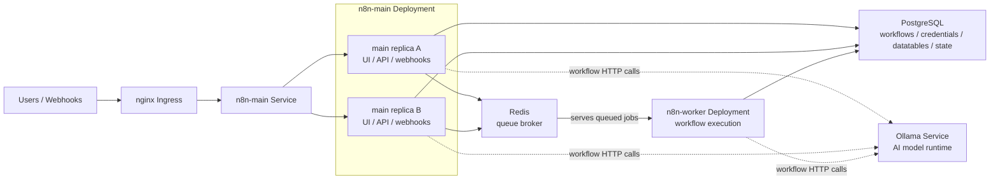
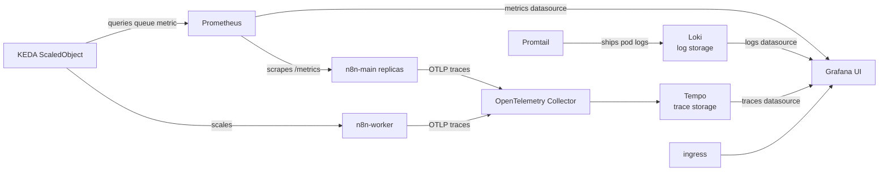

# n8n Local Kubernetes Stack

A Helm chart for running a local, self-hosted n8n Enterprise-style Kubernetes lab with queue workers, nginx ingress, observability, and an optional in-cluster Ollama model runtime.

This repository is intended to be safe to publish while still supporting a private local deployment. Commit the chart and example values. Keep local overrides, rendered manifests, and exported live cluster state out of Git.

## Architecture

### Runtime



The `n8n-main` replicas serve the UI, API, and webhooks behind one Kubernetes Service. Workflow execution is pushed into Redis queue mode, where workers pick up jobs and execute them. PostgreSQL stores n8n data such as workflows, credentials, datatables, execution state, and settings. Ollama is available as an internal model service for workflows that call it.

### Observability And Autoscaling



KEDA uses Prometheus as its scaler backend. The chart's `ScaledObject` queries `n8n_scaling_mode_queue_jobs_waiting` and scales the `n8n-worker` Deployment when the queue has waiting jobs. Grafana reads Prometheus, Loki, and Tempo as observability datasources and is exposed through the same local ingress.

## Components

| Component | Purpose |
| --- | --- |
| `n8n-main` | n8n UI, API, and webhook process, deployed with multiple replicas. |
| `n8n-worker` | Worker process that executes workflows from the Redis queue. |
| `postgres` | Persistent n8n database for workflows, credentials, datatables, execution state, and other n8n data. |
| `redis` | Queue broker that serves workflow jobs to n8n workers. |
| `ingress` | nginx Ingress for local access to n8n and Grafana. |
| `ollama` | Optional self-hosted AI model service available inside the cluster. |
| `prometheus` | Metrics collection. |
| `grafana` | Dashboard UI for metrics, logs, and traces. |
| `loki` | Log storage. |
| `promtail` | Pod log collector. |
| `tempo` | Trace storage. |
| `otel-collector` | OpenTelemetry receiver and trace exporter. |
| `keda` | Worker autoscaling based on queue metrics. |

## Repository Layout

```text
n8n-enterprise-local/
├── Chart.yaml
├── values.yaml
├── values.local.example.yaml
└── templates/
    ├── n8n-main.yaml
    ├── n8n-worker.yaml
    ├── postgres.yaml
    ├── redis.yaml
    ├── ingress.yaml
    ├── prometheus.yaml
    ├── grafana.yaml
    ├── loki.yaml
    ├── tempo.yaml
    ├── otel-collector.yaml
    ├── promtail.yaml
    ├── keda.yaml
    ├── ollama-deployment.yaml
    ├── ollama-models-job.yaml
    ├── ollama-service.yaml
    ├── ollama-pvc.yaml
    └── secrets.yaml
```

## Values Strategy

Use layered values:

- `values.yaml`: committed defaults and reusable template values.
- `values.local.example.yaml`: committed example for local overrides.
- `values.local.yaml`: private local overrides, ignored by Git.
- `values.secret.yaml` or Kubernetes secrets: private credentials, ignored by Git.

Defaults target local development with `n8n.local` and `grafana.local` over HTTP through nginx ingress.

## Prerequisites

- A Kubernetes cluster with a default `StorageClass`.
- `kubectl` configured for that cluster.
- Helm 3.
- An nginx Ingress Controller installed in the cluster.
- KEDA installed if you want the worker autoscaler to run.
- The original `N8N_ENCRYPTION_KEY` if restoring existing n8n data.

## First-Time Setup

Create the namespace:

```bash
kubectl create namespace n8n
```

Create a private local values file:

```bash
cp values.local.example.yaml values.local.yaml
```

Add local hostnames to `/etc/hosts`:

```text
127.0.0.1 n8n.local grafana.local
```

Point `127.0.0.1` at wherever your ingress controller is reachable. For Docker Desktop, minikube tunnel, or kind with a local load balancer, that is usually localhost.

Create required secrets:

```bash
kubectl -n n8n create secret generic n8n-secrets \
  --from-literal=POSTGRES_PASSWORD='replace-me' \
  --from-literal=N8N_ENCRYPTION_KEY='replace-me'
```

Install KEDA:

```bash
helm repo add kedacore https://kedacore.github.io/charts
helm repo update
helm upgrade --install keda kedacore/keda --namespace keda --create-namespace
```

Deploy the stack:

```bash
helm upgrade --install n8n-local . --namespace n8n -f values.local.yaml
```

## Updating an Existing Deployment

If this chart is being pointed at existing n8n data, do not change `N8N_ENCRYPTION_KEY`. Existing credentials depend on it.

Render and diff before applying:

```bash
helm template n8n-local . --namespace n8n -f values.local.yaml > rendered.yaml
kubectl diff -n n8n -f rendered.yaml
```

Then upgrade:

```bash
helm upgrade n8n-local . --namespace n8n -f values.local.yaml
```

## Verification

Check pods:

```bash
kubectl get pods -n n8n
```

Check services and storage:

```bash
kubectl get svc -n n8n
kubectl get pvc -n n8n
```

Check ingress:

```bash
kubectl get ingress -n n8n
```

Open n8n at `http://n8n.local/` and Grafana at `http://grafana.local/`.

Check n8n logs:

```bash
kubectl logs -n n8n deploy/n8n-main --tail=100
kubectl logs -n n8n deploy/n8n-worker --tail=100
```

Check Ollama:

```bash
kubectl exec -n n8n deploy/ollama -- ollama list
```

If `ollama.models` is set in your values file, Helm runs a post-install/post-upgrade Job to pull those models. You can also pull a model manually:

```bash
kubectl exec -n n8n deploy/ollama -- ollama pull llama3.1
```

## Common Operations

Upgrade after chart changes:

```bash
helm upgrade n8n-local . --namespace n8n -f values.local.yaml
```

View release history:

```bash
helm history n8n-local --namespace n8n
```

Rollback:

```bash
helm rollback n8n-local <revision> --namespace n8n
```

Uninstall the release:

```bash
helm uninstall n8n-local --namespace n8n
```

The uninstall command does not always remove persistent volumes, depending on the cluster and reclaim policy. Review PVCs before deleting data.

## Data And Secrets

Important local-only files are ignored by Git:

- `values.local.yaml`
- `values.secret.yaml`
- `values.secrets.yaml`
- `live-*.yaml`
- `rendered*.yaml`
- `*.dump`
- `*.sql`

For existing n8n data, preserve:

- `N8N_ENCRYPTION_KEY`
- Postgres password
- Postgres PVC or database contents
- n8n public URL and webhook URL

## Helm-Managed Secrets

By default, the chart expects secrets to already exist in Kubernetes. For local-only labs, the chart can create them if `secrets.create=true` and values are provided through a private values file or `--set`.

Example private file:

```yaml
secrets:
  create: true
  postgresPassword: replace-me
  n8nEncryptionKey: replace-me
```

Deploy with:

```bash
helm upgrade --install n8n-local . \
  --namespace n8n \
  -f values.local.yaml \
  -f values.secret.yaml
```

Do not commit secret values.

## Included Wiring

The chart wires the core architecture end to end:

- nginx Ingress exposes `n8n-main` and Grafana on local hostnames.
- `n8n-main` serves UI/API/webhooks and writes to Postgres.
- `n8n-worker` executes queued workflows.
- Redis is configured as the n8n queue broker.
- Postgres persists n8n data.
- n8n metrics are enabled on the main replicas for Prometheus and KEDA.
- n8n OTLP tracing is enabled for main and worker pods and exported to the OpenTelemetry Collector.
- OpenTelemetry exports traces to Tempo.
- Promtail ships pod logs to Loki.
- Grafana datasources for Prometheus, Loki, and Tempo are provisioned by the chart.
- Ollama is deployed as an internal service with persistent model storage when enabled.
- Optional Ollama model bootstrap pulls configured models after install/upgrade.
- Optional n8n Enterprise license wiring can read `N8N_LICENSE_ACTIVATION_KEY` from a secret.

## Configuration Flags

| Value | Default | Purpose |
| --- | --- | --- |
| `ingress.enabled` | `true` | Create nginx Ingress for n8n and Grafana. |
| `ollama.enabled` | `true` | Deploy Ollama and related PVC/Service. |
| `keda.enabled` | `true` | Create the worker `ScaledObject`. Requires KEDA in the cluster. |
| `n8n.otel.enabled` | `true` | Export OTLP traces from n8n pods. |
| `n8n.license.enabled` | `false` | Read Enterprise license key from a secret. |
| `secrets.create` | `false` | Let Helm create the `n8n-secrets` Secret. |

## Notes

- `n8n-main` is exposed internally through the `n8n-main` Service.
- External traffic enters through the local nginx Ingress.
- `N8N_SECURE_COOKIE=false` is set for local HTTP access.
- `postgres-data` stores n8n database data.
- `ollama-data` stores Ollama model data.
- KEDA scales `n8n-worker` based on Prometheus queue metrics.
- The chart defaults are designed for a local lab, not a hardened production environment.
