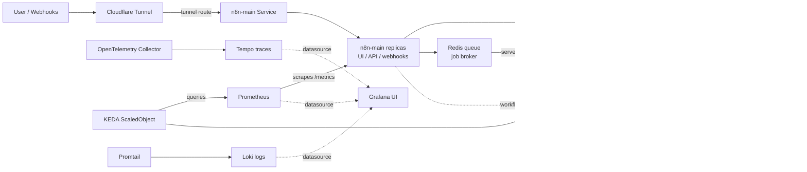

# n8n Local Kubernetes Stack

A Helm chart for running a local, self-hosted n8n Enterprise-style Kubernetes lab with queue workers, observability, Cloudflare Tunnel ingress, and an in-cluster Ollama model runtime.

This repository is intended to be safe to publish while still supporting a private local deployment. Commit the chart and example values. Keep local overrides, rendered manifests, and exported live cluster state out of Git.

## Architecture



Solid arrows are chart-configured paths. Dotted arrows represent services that are available in-cluster but may require workflow or Grafana datasource configuration. Grafana reads from Prometheus, Loki, and Tempo as observability datasources.

## Components

| Component | Purpose |
| --- | --- |
| `n8n-main` | n8n UI, API, and webhook process, deployed with multiple replicas. |
| `n8n-worker` | Worker process that executes workflows from the Redis queue. |
| `postgres` | Persistent n8n database for workflows, credentials, datatables, execution state, and other n8n data. |
| `redis` | Queue broker that serves workflow jobs to n8n workers. |
| `cloudflared` | Cloudflare Tunnel process for external ingress. |
| `ollama` | Self-hosted AI model service available inside the cluster. |
| `prometheus` | Metrics collection. |
| `grafana` | Dashboard UI for metrics, logs, and traces. |
| `loki` | Log storage. |
| `promtail` | Pod log collector. |
| `tempo` | Trace storage. |
| `otel-collector` | OpenTelemetry receiver and trace exporter. |
| `keda` | Worker autoscaling based on queue metrics. |

## Repository Layout

```text
n8n-local-k8s/
├── Chart.yaml
├── values.yaml
├── values.local.example.yaml
└── templates/
    ├── n8n-main.yaml
    ├── n8n-worker.yaml
    ├── postgres.yaml
    ├── redis.yaml
    ├── cloudflared.yaml
    ├── prometheus.yaml
    ├── grafana.yaml
    ├── loki.yaml
    ├── tempo.yaml
    ├── otel-collector.yaml
    ├── promtail.yaml
    ├── keda.yaml
    ├── ollama-deployment.yaml
    ├── ollama-service.yaml
    ├── ollama-pvc.yaml
    └── secrets.yaml
```

## Values Strategy

Use layered values:

- `values.yaml`: committed defaults and reusable template values.
- `values.local.example.yaml`: committed example for local overrides.
- `values.local.yaml`: private local overrides, ignored by Git.
- `values.secret.yaml` or Kubernetes secrets: private credentials, ignored by Git.

The default chart uses placeholder public URLs. Your real domain belongs in `values.local.yaml`.

## Prerequisites

- A Kubernetes cluster with a default `StorageClass`.
- `kubectl` configured for that cluster.
- Helm 3.
- KEDA installed if you want the worker autoscaler to run.
- A Cloudflare Tunnel token if using `cloudflared`.
- The original `N8N_ENCRYPTION_KEY` if restoring existing n8n data.

## First-Time Setup

Create the namespace:

```bash
kubectl create namespace n8n
```

Create a private local values file:

```bash
cp values.local.example.yaml values.local.yaml
```

Edit `values.local.yaml`:

```yaml
n8n:
  publicUrl:
    host: n8n.your-domain.com
    protocol: https
    port: "5678"
    webhookUrl: https://n8n.your-domain.com/
    editorBaseUrl: https://n8n.your-domain.com/

  proxyHops: "1"

ollama:
  enabled: true
  persistence:
    size: 30Gi
```

Create required secrets:

```bash
kubectl -n n8n create secret generic n8n-secrets \
  --from-literal=POSTGRES_PASSWORD='replace-me' \
  --from-literal=N8N_ENCRYPTION_KEY='replace-me'

kubectl -n n8n create secret generic cloudflared-token \
  --from-literal=TUNNEL_TOKEN='replace-me'
```

Install KEDA:

```bash
helm repo add kedacore https://kedacore.github.io/charts
helm repo update
helm upgrade --install keda kedacore/keda --namespace keda --create-namespace
```

Deploy the stack:

```bash
helm upgrade --install n8n-local . --namespace n8n -f values.local.yaml
```

## Updating an Existing Deployment

If this chart is being pointed at existing n8n data, do not change `N8N_ENCRYPTION_KEY`. Existing credentials depend on it.

Render and diff before applying:

```bash
helm template n8n-local . --namespace n8n -f values.local.yaml > rendered.yaml
kubectl diff -n n8n -f rendered.yaml
```

Then upgrade:

```bash
helm upgrade n8n-local . --namespace n8n -f values.local.yaml
```

## Verification

Check pods:

```bash
kubectl get pods -n n8n
```

Check services and storage:

```bash
kubectl get svc -n n8n
kubectl get pvc -n n8n
```

Check n8n logs:

```bash
kubectl logs -n n8n deploy/n8n-main --tail=100
kubectl logs -n n8n deploy/n8n-worker --tail=100
```

Check Cloudflared:

```bash
kubectl logs -n n8n deploy/cloudflared --tail=100
```

Check Ollama:

```bash
kubectl exec -n n8n deploy/ollama -- ollama list
```

Pull a model:

```bash
kubectl exec -n n8n deploy/ollama -- ollama pull llama3.1
```

## Common Operations

Upgrade after chart changes:

```bash
helm upgrade n8n-local . --namespace n8n -f values.local.yaml
```

View release history:

```bash
helm history n8n-local --namespace n8n
```

Rollback:

```bash
helm rollback n8n-local <revision> --namespace n8n
```

Uninstall the release:

```bash
helm uninstall n8n-local --namespace n8n
```

The uninstall command does not always remove persistent volumes, depending on the cluster and reclaim policy. Review PVCs before deleting data.

## Data And Secrets

Important local-only files are ignored by Git:

- `values.local.yaml`
- `values.secret.yaml`
- `values.secrets.yaml`
- `live-*.yaml`
- `rendered*.yaml`
- `*.dump`
- `*.sql`

For existing n8n data, preserve:

- `N8N_ENCRYPTION_KEY`
- Postgres password
- Postgres PVC or database contents
- n8n public URL and webhook URL
- Cloudflare Tunnel token

## Helm-Managed Secrets

By default, the chart expects secrets to already exist in Kubernetes. For local-only labs, the chart can create them if `secrets.create=true` and values are provided through a private values file or `--set`.

Example private file:

```yaml
secrets:
  create: true
  postgresPassword: replace-me
  n8nEncryptionKey: replace-me
  tunnelToken: replace-me
```

Deploy with:

```bash
helm upgrade --install n8n-local . \
  --namespace n8n \
  -f values.local.yaml \
  -f values.secret.yaml
```

Do not commit secret values.

## Notes

- `n8n-main` is exposed internally through the `n8n-main` Service.
- External traffic is expected to enter through Cloudflare Tunnel.
- `postgres-data` stores n8n database data.
- `ollama-data` stores Ollama model data.
- KEDA scales `n8n-worker` based on Prometheus queue metrics.
- The chart defaults are designed for a local lab, not a hardened production environment.
